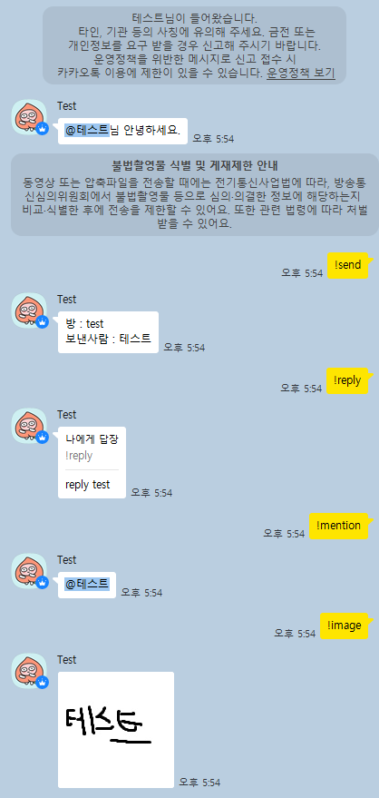

# loco-wrapper

안드로이드 카카오톡 25.9.2 기반 비공식 카카오톡 클라이언트 (태블릿 서브 디바이스 로그인)

현재 오픈 채팅방에서만 작동합니다.

절대 본계정으로 돌려보지마세요.

<U>**device uuid 무조건 바꾸시오.**</U>

## Example



Main.java 파일 참고
```java
TalkClient client = new TalkClient(email, password, deviceName, deviceUuid, new TalkHandler() {
    @Override
    public void onMessage(Message msg) {
        if (msg.getType() != 1) return; // 1이 그냥 채팅, 그냥 채팅만 받기
        if (msg.getMessage().equals("!send")) {
            getTalkClient().sendMessage(msg.getChatRoom().getChatId(), "방 : " + msg.getChatRoom().getName() + "\n보낸사람 : " + msg.getAuthor().getName());
        } else if (msg.getMessage().equals("!reply")) { // 답장
            int replyType = 26; // 답장 타입
            JsonObject extraObject = new JsonObject();
            extraObject.addProperty("src_logId", msg.getLogId());
            extraObject.addProperty("src_userId", msg.getAuthor().getId());
            extraObject.addProperty("src_message", msg.getMessage());
            extraObject.addProperty("src_type", msg.getType());
            extraObject.addProperty("src_linkId", msg.getChatRoom().getLinkId());
            getTalkClient().sendMessage(msg.getChatRoom().getChatId(), replyType, "reply test", extraObject.toString());
        } else if (msg.getMessage().equals("!mention")) { // 멘션
            JsonObject extraObject = new JsonObject();
            JsonArray mentionArray = new JsonArray();
            JsonObject mentionObject = new JsonObject();
            mentionObject.addProperty("user_id", msg.getAuthor().getId());
            JsonArray pos = new JsonArray();
            pos.add(1);
            mentionObject.add("at", pos);
            mentionObject.addProperty("len", msg.getAuthor().getName().length());
            mentionArray.add(mentionObject);
            extraObject.add("mentions", mentionArray);
            getTalkClient().sendMessage(msg.getChatRoom().getChatId(), 1, "@" + msg.getAuthor().getName(), extraObject.toString());
        } else if (msg.getMessage().equals("!image")) {
            byte[] imageBytes = ByteUtil.hexStringToByteArray("FFD8FFE000104A46494600010101006000600000FFDB0043000201010201010202020202020202030503030303030604040305070607070706070708090B0908080A0807070A0D0A0A0B0C0C0C0C07090E0F0D0C0E0B0C0C0CFFDB004301020202030303060303060C0807080C0C0C0C0C0C0C0C0C0C0C0C0C0C0C0C0C0C0C0C0C0C0C0C0C0C0C0C0C0C0C0C0C0C0C0C0C0C0C0C0C0C0C0C0C0C0C0C0C0CFFC00011080080008003012200021101031101FFC4001F0000010501010101010100000000000000000102030405060708090A0BFFC400B5100002010303020403050504040000017D01020300041105122131410613516107227114328191A1082342B1C11552D1F02433627282090A161718191A25262728292A3435363738393A434445464748494A535455565758595A636465666768696A737475767778797A838485868788898A92939495969798999AA2A3A4A5A6A7A8A9AAB2B3B4B5B6B7B8B9BAC2C3C4C5C6C7C8C9CAD2D3D4D5D6D7D8D9DAE1E2E3E4E5E6E7E8E9EAF1F2F3F4F5F6F7F8F9FAFFC4001F0100030101010101010101010000000000000102030405060708090A0BFFC400B51100020102040403040705040400010277000102031104052131061241510761711322328108144291A1B1C109233352F0156272D10A162434E125F11718191A262728292A35363738393A434445464748494A535455565758595A636465666768696A737475767778797A82838485868788898A92939495969798999AA2A3A4A5A6A7A8A9AAB2B3B4B5B6B7B8B9BAC2C3C4C5C6C7C8C9CAD2D3D4D5D6D7D8D9DAE2E3E4E5E6E7E8E9EAF2F3F4F5F6F7F8F9FAFFDA000C03010002110311003F00FDFCA28A2800A28A2800A28A2800A28A2800A28A2800A28A2800A28A2800A28A2800A28A2800A28A2800A28A2800A28A2800A28A2800A28A2800A28A2800A28A2800A28AFC03F811F03FF69AFF0082C67FC14A3F6CED1749FDB3BE2F7C15D13E0A7C429F47D374ED16E2FA6B392D64BFD52DE08A38A0BFB5484451E9E80E03190C858E1812C01FBF9593E0DF1F685F1174D9AF7C3DAD693AED9DB5CCB6734FA75E47751453C4DB6489990901D1B8653C83C102BC67FE09BDFB24F8F3F62BFD9C8782BE227C6CF157C7BD793539EF63F12F882DDA1BB8A0758C25A8DF3CF232214760D24AED995870A1547E77FF00C19B1E263E0CFD95FE3CFC1ED76DB51D37E217C39F89735E78874FBA88A9B1FB4DA4168885B3CC827D2EF1597F8760FEF5007E8C7ECA7FF0514F869FB667C6BF8C9E00F03DEEA975E20F815AE2787FC50B7564D042972CF711FEE5C9FDE2896D2E109C0E6227054AB37BA57E247EC3CDA27EC63FF077F7ED09E028E4D7B4AD23E33F87AE353D22D6532C96FAB6AB73058EB77131E8BB15935708E7210EE8C1C922BF407FE0AE5FF057FF00871FF0497F80F36BDE24B9B6D67C6FAB42CBE19F09C370AB79ABCBC81238E4C76C8DF7E523031B577390A403DB7C25FB617C30F1E7ED23E21F841A378DB43D4FE25F84F4E4D5B57F0FDBCC5EEB4FB666440EF81B461A48832E772F9B1EE037AE7D26BF273FE0D93FD823C67E171F15BF6B2F8C9A19D23E2A7ED11AA4FA858DB4D6FE44961A55CCFF006D96454DD98D6EAE5D5846E32B1D9C0C0E1C8AFD63A0028AFC2BF097FC1CF7E23FD97FFE0A2DFB50D9FC78BCD635EF841E00F185E782FC2BE1EF0AF85EDA4BFB5B98AFEEA18666BA92485361B7B198C8B34CCEF24AA625091C807AB7FC46ADFB2C7FD083FB407FE08F48FF00E59D007EBF515F9E3FF0496FF83863C23FF0575FDAA7C71F0F7C1FF0CFC5FE18D1FC2DA1FF006F59EBBAB5CC2E6F6313C103453C11065B794B4F945134A1D6290E576E2BF43A800A28A2800A28A2800AFE69BF647FD90BF6ABFDA47FE0AD3FB707887F658F8D3A67C27D73C0DF176FDB59B5D5AFEE61D375C8EE755D6FC969A18EDEE61B83098240A93C2CA3ED0C415390DFD2CD7E40FC4DFF00834EAD3E26FEDDFE30F8B0FF00B4578C746F0978E7C77278EB54F0A695A335A5CB4EF7335C044BF4BC015E37B89C4737D9CBC6B2B01C92C403A6BA3FF056CFD96BE04DCDB6CF80DFB49F8D75BD502C1776F241A6B7876CD616DCCC8EBA5C3333C8C9B7018C7E51DC24127EEFE79FF83587C49F113E04FF00C150FF006B8F841F1BF43D534FF8D1E2FB3B2F1BF88249E5B79152782EA479CBB42CD1B19CEBB04A8D1128543107056BF77ABF193E18F8B2F3F676FF0083D0FE2259EBDA1EA090FC79F87B158786EE81511C9141A4E9D70F72727263F3342BD838E7CC038C026800FF0082EF7856FF00E087FC17E7FE09F3F16BC3BAE5ED8EBBE35D7EDFC07770A227971D845AADB47300482499E0D7AEA27F45518C139AF60FDB2FFE0D4CF807FB6A7C7BF1EFC4EF1078EFE3459F8BBC75732DF3797AD59DC5869B3BE0AF951CB68D2F92A4604466C042554A00BB7C7FFE0F2BF0ADFF00C3EF80DFB3BFC75F0F6B97BA378C7E167C42363A2B40885629AEEDFEDCB739607E78A5D1A0DA3041F31B3D057B27ED77FF00075D7ECE5FB197ED27E2FF0085DE23F097C69D575FF04EA0FA66A171A5E85622D1A64FBC233717B0C8CB9E8FE585618652CA43100F8EB505FDBA7FE0D98D734EBABAD5350FDA7BF65EB3F344D0C31DC13A1DAA2801A5678E69349009CA85925B538C13BD801FB43FB09FED8FE18FF8280FEC97E0BF8C1E0E86FEDB40F1A5A493436F7B1ECB8B59619E4B79E17C704C73C32A6E1C36DC8E08AFCD4D57FE0F41FD93F5DD2EE6C6FBE1C7C78BCB2BC89A0B8B79FC3FA3C914F1B02AC8EA7522194824107820D751FF00047BFF0082D0789BFE0A1BFB65CBE00F815FB3F68DE06FD92FC11A5BC53EA92D9A6997BA2CE6277863486DA46B35F326F945B4419821794C9C6DA00F953F62EFF829C7803FE08B5FF053DFF828BB7C68D27C6B16A3E2CF1F45AEE91A668DA5ADD5D5E5A36A7A9CC92E5E48E24578755B3954C8EA1964E0EEC29FBCBE047FC1D55FB16FC6AD274D7BFF00889AC7C3FD5752B8FB3AE95E28F0F5E4535B92D85796E2D927B44439CEE33E00FBDB6BC53FE0BCFF00F04E6F8A9F073F6C0F08FEDE3FB3669F0EA9F103E1D4313F8BBC3E96E649359B5B789E26BADAAC1E60D66C6D668D0893C95428432B1AE3BF66EFDB17FE0965FF000554F83961A7FC57F879F03BE127C43D641D47C43617FA6AF84E54BB46DD2491EB96EB6E24491C960A6E43B8387426803F57FE0EFEDD1F04BF689F159D07E1FF00C62F857E3AD7044D39D3BC3DE2CB0D4EEC46BF79FCA82567DA3B9C6057AA57F343FF000538FD82BFE09FEFFB6AFECB1F0DFF0067FD42DF55B3F8B7E2C8FC35E2A93E1FFC4B8F598F48827BBB3B686776B917FB6766BA7651BD14ADB38284B075FD5BFF008255FF00C1BF3E12FF008247FED4FE2DF1D7803E27F8EB5EF0AF89FC36BA20F0CEBA9039867FB443335E493C2228E56021D918FB3A945965CBB6EE003F40E8A28A0028A28A0028A28A002BF2ABFE0A5FFF0004E5FDA1FE2C7FC1C01FB317ED07F0A74AB67F02F8234FD2F47F146AE356B4B7974DB48F53BF7D4236825712C8B3585F4912F948E496607670D5FAAB45007C63FF0005DBFF00825BEA7FF056EFD8757E1CF87FC47A7F867C4FA16BF6FE26D1A7D415CD85CDCC305CDBF9170C8ACE91B477527CE8AC55954ED61907E9FF00D9F7C2BE26F02FC05F04689E35D723F13F8CB46D02C2C75ED6635DA9AB5FC56F1A5CDC81818124AAEF8C0FBDD0575F450014515F991FB5DFECC3FF00054BF1B7ED27E2FD4FE10FED1BF033C23F0CEEF5077F0E6937BA4466EECACFFE59A4C64D1EE98CA07DE6F39831C9010108A01FA6F5F2DFED53FF000450FD957F6D3F109D63E227C12F07EA5ADCB7525EDCEA9A6ACDA1DFEA13480067B9B8B192096E49C0FF005CCF83C8C126BE09F007ED07FF0005A1F853A1BE87A8FC0CF837F132E2CAE2551E21D56FF4AB79EFD3710AC12D756B38C26065736E8F83F30CF00D3FFE0B6DFF000515FD9C7C79A8E87F18BF607D4FC7339B78A6B46F8756BA97D960DD93F3DE5BFF006ADBCA703EE2B2329FBDD71401F6C7ECD1FF00040AFD917F640F8CBA4FC40F87FF000734FD27C5DA0B349A75F5DEB7AA6A82CE4231E624577732C4241FC2FB7729E54835F6157E40FF00C4477FB53FFD231FF680FF00BFDABFFF0028E8FF00888EFF006A7FFA463FED01FF007FB57FFE51D007EBF515F987FB27FF00C1777F685F8FBFB46F83BC17E2AFF827D7C75F879A0789B53874FBCF12DD9BF7B5D112460A6E66F3F4BB78C4499DCC4CAA7683B433614FE9E500145145001451450014514500145145001451450014514500145145001451450014514500145145001451450014514500145145001451450014514500145145001451450014514500145145001451450014514500145145001451450014514500145145007FFFD9"); // 테스트 jpg 이미지 hex
            getTalkClient().sendJpg(msg.getChatRoom().getChatId(), imageBytes, "jpg", 128, 128);
        }
    }

    @Override
    public void onNewMember(ChatRoom room, Member member) {
        JsonObject extraObject = new JsonObject();
        JsonArray mentionArray = new JsonArray();
        JsonObject mentionObject = new JsonObject();
        mentionObject.addProperty("user_id", member.getId());
        JsonArray pos = new JsonArray();
        pos.add(1);
        mentionObject.add("at", pos);
        mentionObject.addProperty("len", member.getName().length());
        mentionArray.add(mentionObject);
        extraObject.add("mentions", mentionArray);
        getTalkClient().sendMessage(room.getChatId(), 1, "@" + member.getName() + "님 안녕하세요.", extraObject.toString());
    }

    @Override
    public void onDelMember(ChatRoom room, Member member) {
        getTalkClient().sendMessage(room.getChatId(), member.getName() + "님이 나갔습니다.");
    }
});
```

## Usage

첫 로그인시에 기기등록이 필요합니다. 콘솔창에 방법 나오니 따라하세요.

로그인하면 로그인 정보(토큰 등)가 email_deviceName 폴더 안에 저장됩니다. 서버 연결이 안되면 삭제하고 시도하세요.
