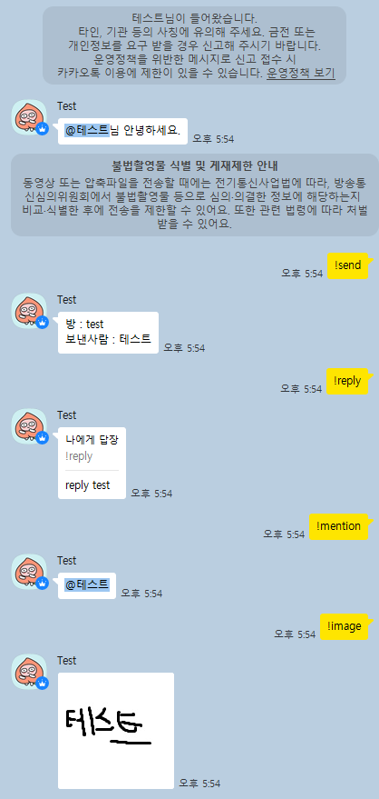

# loco-wrapper

안드로이드 카카오톡 26.8.2 기반 비공식 카카오톡 클라이언트 (태블릿 서브 디바이스 로그인)

되도록이면 부계정으로 돌리길 추천합니다.

예제에 있는 uuid 그대로 쓰지 마세요.

자바 21 이상에서 작동합니다.

## 2026-10-03 업데이트

현재 이 프로젝트는 활발하게 유지보수되고 있지는 않지만, 이 프로젝트를 참고한 다른 프로젝트들이 있는 것으로 확인되어 최신 프로토콜 대응 패치를 진행했습니다.

### LOCO 암호화 레이어 변경

카카오톡 **26.6.0 버전부터 LOCO 프로토콜의 암호화 레이어가 V2SL에서 TLS로 변경**되었습니다.

보안성 향상을 위해 TLS를 도입한 것으로 보이며, 향후 기존 V2SL 암호화 레이어에 대한 지원을 종료할 가능성이 있어 보입니다.

패치 방법은 기존 방식처럼 암호화 로직을 직접 구현할 필요 없이, TLS 구현체를 사용하면 됩니다.

이 프로젝트를 기준으로는 기존 `LocoSecureCodec`을 제거하고, 해당 위치에 TLS 코덱을 추가하면 됩니다.

조금 더 구체적으로 설명하면, 기존의 **RSA-OAEP + AES-GCM 기반 V2SL 암호화 레이어를 제거**하고, TLS 연결 위에서 기존과 동일한 **22바이트 헤더를 갖는 LOCO 패킷**을 전송하면 됩니다.

`booking`, `checkin` 로직은 기존과 동일한 것으로 보입니다. 현재 테스트에서는 정상적으로 동작하지만, 모든 경우에 대해 확인한 것은 아닙니다.

`checkin` 역시 V2SL이 아닌 TLS를 사용합니다.

### 26.8.2 대응 패치

이에 맞춰 작성일 기준 안드로이드 카카오톡 최신 버전인 **26.8.2**에 대응하는 패치를 적용했습니다.

변경 사항은 다음과 같습니다.

- Netty 파이프라인에서 기존 `LocoSecureCodec` 제거
- 해당 위치에 TLS 코덱 추가
- 클라이언트 버전을 `25.9.2`에서 `26.8.2`로 변경
- `26.8.2` 버전에 맞게 `X-VC` 생성 시드 수정

### TLS 인증서 검증

현재 적용된 TLS 코덱은 **모든 인증서를 신뢰하도록 설정**되어 있습니다.

보안성을 높이려면 적절한 인증서 검증 로직을 추가하는 것을 권장합니다.

### 이미지 전송

이미지 전송은 여전히 기존 **V2SL 암호화 레이어를 사용하는 것으로 확인**되었습니다.

따라서 현재 `Main.java`의 예제 코드에서는 이미지 전송 부분을 우선 주석 처리해 두었습니다.

### 참고

이번 업데이트에서는 **암호화 레이어 변경에 필요한 부분만 수정**했으며, 그보다 상위 레이어의 로직은 별도로 업데이트하지 않았습니다.

## Example



Main.java 파일 참고
```java
TalkClient client = new TalkClient(email, password, deviceName, deviceUuid, new TalkHandler() {
    @Override
    public void onMessage(Message msg) {
        if (msg.getType() != MessageType.TEXT) return; // 그냥 텍스트 채팅만 받기
        if (msg.getMessage().equals("!count")) { // 멤버 수
            msg.getChatRoom().sendMessage("멤버수 : " + msg.getChatRoom().getMemberCount());
        }
        else if (msg.getMessage().equals("!type")) { // 보낸 사람 권한
            int type = msg.getAuthor().getMemberType();
            String t = "";
            if (type == MemberType.OWNER) t = "방장";
            if (type == MemberType.ADMIN) t = "부방장";
            if (type == MemberType.MEMBER) t = "일반 멤버";
            if (type == MemberType.BOT) t = "방장봇";
            msg.getChatRoom().sendMessage("당신의 멤버 타입 : " + t);
        }
        else if (msg.getMessage().equals("!kick")) { // 강퇴 (당연히 방장이나 부방장 권한 있을때만 작동합니다.)
            msg.getAuthor().kick();
        }
        else if (msg.getMessage().equals("!send")) { // 일반 메세지
            msg.getChatRoom().sendMessage("방 : " + msg.getChatRoom().getName() + "\n보낸사람 : " + msg.getAuthor().getNickName());
        }
        else if (msg.getMessage().equals("!reply")) { // 답장
            msg.reply("reply test");
        }
        else if (msg.getMessage().equals("!mention")) { // 멘션
            String extra = "{\"mentions\":[{\"user_id\":" + msg.getAuthor().getUserId() + ",\"at\":[1],\"len\":" + msg.getAuthor().getNickName(length() + "}]}";
            msg.getChatRoom().sendMessage("@" + msg.getAuthor().getNickName(), extra);
        }
    }

    @Override
    public void onNewMember(ChatRoom room, Member member) {
        String extra = "{\"mentions\":[{\"user_id\":" + member.getUserId() + ",\"at\":[1],\"len\":" + member.getNickName().length() + "}]}";
        room.sendMessage("@" + member.getNickName() + "님 안녕하세요.", extra);
    }

    @Override
    public void onDelMember(ChatRoom room, long userId, String nickName) {
        room.sendMessage(nickName + "님이 나갔습니다.");
    }
});
```
## Build

```
./gradlew jar
```
jdk21 이상 필요

jar 파일은 build/libs 디렉터리 안에 생성됩니다.

## Usage

첫 로그인시에 기기등록이 필요합니다. 콘솔창에 방법 나오니 따라하세요.

로그인하면 로그인 정보(토큰 등)가 email_deviceName 포멧의 이름을 가진 폴더 안에 저장됩니다. 서버 연결이 안되면 삭제하고 시도하세요.
